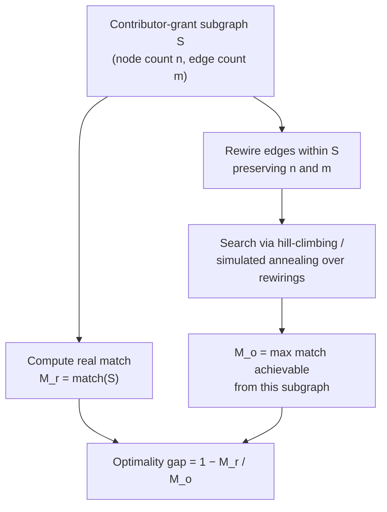

# Crowdfunding and open-source grants analysis

Matching-mechanism modeling for crowdfunded open-source grants platforms — adversarial-robustness analysis, Sybil-attack characterization and detection, and parameter sensitivity of donation-matching algorithms. Built on cadCAD for simulation and scikit-learn for the classification pipeline.

Research archive. Part of DSG's ongoing program in public-goods funding mechanism design. Originally developed 2020–2021.

## Scope

This repository models a class of crowdfunded grants mechanisms — sponsor pools matched to grassroots donations according to formulas that weight *breadth* of community support rather than *depth* (dollar amount) alone. The specific matching formula studied here is quadratic funding (Buterin, Hitzig, Weyl 2019), but the methods extend to any donation-matching mechanism that aims to surface community preference via crowdfunded signal.

The matching formula penalizes concentrated funding sources and amplifies small donations from many distinct contributors — by construction, it favors community-supported projects over high-net-worth sponsorship. The mechanism's central design risk is its sensitivity to Sybil attacks and coordinated coalitions: a small group of colluding contributors can manufacture the appearance of broad support, capturing matching funds intended for diffusely-supported projects. The matching-mechanism literature therefore lives at the intersection of mechanism design, network analysis, and adversarial-robustness theory.

The work in this repo splits across three threads: **attack characterization** (what real attacks look like in funding-round data), **detection and quantification** (post-hoc identification of Sybils and the matching pool at risk), and **parameter sensitivity** (how mechanism choices shift the collusion–participation trade-off).

### Attack characterization
- What attack-pattern topologies appear in real funding-round contribution graphs? Two recurring patterns are surfaced in the data: *many-to-one* (one contributor funding many grants) and *many-to-many* (coordinated clusters of contributors and grants).
- For a given subgraph of suspected colluders, how much matching funding could the attacker extract via edge-rewiring? Cast as a meta-heuristic optimization over the contributor-grant bipartite graph using hill-climbing and simulated annealing (per the methodology in Paterson & Ombuki-Berman 2020).
- How does the optimality gap — the distance between actual and ideal matching allocations — shift in response to specific adversarial inputs?

### Detection and quantification
- Can supervised-learning classifiers (Random Forest, Decision Tree) trained on contributor-graph features flag likely Sybil contributors, and how do they perform under standard cross-validation metrics (ROC AUC)?
- For a flagged subset of likely Sybils, what fraction of the matching pool was at risk of mis-allocation?
- Which network structures in the contributor-grant bipartite graph correspond to coordinated coalitions versus organic clusters of community-supported projects? Surfaced via greedy-modularity community detection.

### Parameter sensitivity
- How do parameter choices (matching budget, contribution caps, identity-verification thresholds) shift the collusion–participation trade-off?

The work was developed in collaboration with an open-source grants platform that had run multiple historical funding rounds, providing the empirical contribution-graph data the analysis is calibrated against.

## Model framework

Built in [cadCAD](https://cadcad.org/) — a Python framework for modeling and simulating complex adaptive systems. The model treats each funding round as a discrete simulation: a contribution-graph state evolves through a sequence of donation events, with the matching algorithm computed at the end of each round and the optimality gap evaluated against a reference allocation.

## How to use

1. Install dependencies: `pip install -r requirements.txt` (Python 3.7+ recommended via Anaconda)
2. Adjust simulation parameters in `env_config.py`
3. Run the simulation: `python run_simulation.py` (generates a pickled simulation result)
4. Open one of the notebooks in `notebooks/` to inspect results

The `run_simulation.py` script accepts CLI flags that override `env_config.py` for common scenarios.

## Analysis library (`qf_research/`)

Python utilities backing the notebooks:

- `quadratic_match.py` — reference implementation of the matching algorithm, including pairwise contribution-overlap computations
- `subgraph_optimizer.py` — adversarial-subgraph analysis: given a subset of nodes in the contributor-grant bipartite graph, finds the rewiring of edges within that subgraph that maximizes a chosen utility function (e.g., matching funds extracted). Used to characterize worst-case attack scenarios on a given subgraph.
- `meta_heuristics.py` — hill-climbing and simulated-annealing meta-heuristics that drive the subgraph optimizer (per Paterson & Ombuki-Berman 2020 on network-robustness optimization via edge rewiring)
- `definitions.py` — core metrics including `grant_conjectured_optimality_gap` (computed on a radius-3 neighborhood subgraph around each grant) and per-grant matching share
- `compare.py`, `functions.py` — comparison utilities and helpers

The adversarial-subgraph analysis flow:



## Notebooks

Nine notebooks in `notebooks/` partition the analysis surface:

**Security-focused**
- `round_9_supervised_public.ipynb` — supervised-ML pipeline for Sybil detection on historical funding-round data: Random Forest and Decision Tree classifiers with k-fold cross-validation (ROC AUC scoring). Outputs per-contributor Sybil flags and quantifies both the flagged-user fraction and the *flagged-amount fraction* — i.e., the share of the matching pool that was at risk of mis-allocation under each classifier's predictions.
- `round_9_attack_analysis.ipynb` — post-hoc characterization of attack-pattern graph topologies in the data: *many-to-one* and *many-to-many* structures.
- `round_9_fraud_EDA.ipynb` — exploratory data analysis of attacker behavior in the contribution graph.
- `attack_vector_ab_test.ipynb` — A/B testing of attack vectors against the optimality-gap metric: measures how much the metric shifts in response to specific adversarial inputs.

**Mechanism characterization**
- `optimality_gap.ipynb` — distribution of the optimality gap (mis-allocation magnitude) across simulated funding rounds. The optimality gap is the central metric for evaluating mechanism robustness.
- `graph_communities.ipynb` — community detection on the contributor-grant bipartite graph using greedy modularity; useful for distinguishing coordinated coalitions from organic clusters.
- `qf_performance_diagnosis.ipynb` — profiling and computational-complexity analysis of the matching algorithm itself.

**Networked-model exemplars**
- `dynamic_network.ipynb` and `temporal_network_example.ipynb` — examples of cadCAD's networked-model patterns.

Each notebook is self-contained and runnable against the pickled simulation output.

## Background

### What does this model do?

In cyber-physical systems — international power grids, global flight networks, socioeconomic community ecosystems — engineers build simulated replicas of the real system, called *digital twins*. The twins manage the complexity of systems with trillions of data points constantly in flux. They translate raw signal into pathways that let humans reason about high-level system behavior and intervene where appropriate — like hitting a breaker switch when a fault is cleared in a power network.

This repository is a digital twin of a crowdfunded grants round. It runs the round through a billion variations, sweeping one parameter at a time, to reveal which parameter choices push the system across stability boundaries — and which mechanisms can pull it back.

### The matching formula (quadratic funding)

The matching algorithm this repository models is *quadratic funding* — allocating matching funds in proportion to the square of the sum of square-roots of donations. The formula was popularized by Buterin, Hitzig, and Weyl (2019) as a mechanism for funding public goods that combines features of voting (one-person-one-vote-like sensitivity to participation breadth) and markets (sensitivity to expressed willingness to pay). In practice, quadratic-funding mechanisms are deployed by open-source grants platforms to allocate sponsor pools across many candidate projects.

The mechanism's mathematical appeal — and its central operational risk — is the same: small concentrated coalitions can extract matching funds disproportionate to their organic community support. The robust-mechanism-design problem is to detect such coalitions, design identity-verification flows that raise the cost of sybilling, and choose parameters that bound the worst-case mis-allocation.

### cadCAD

cadCAD (complex adaptive dynamics Computer-Aided Design) is a Python framework for research-grade modeling and simulation of complex systems. It supports Monte Carlo runs, parameter sweeps, and A/B comparisons natively.

- [Introduction to cadCAD](https://community.cadcad.org/t/introduction-to-cadcad/15)
- [Putting cadCAD in context](https://community.cadcad.org/t/putting-cadcad-in-context/19)
- [cadCAD-org demos](https://github.com/cadCAD-org/demos)

## Methodological learnings

The work in this repository, taken together with the analyses it produced, distilled several generalizable lessons for adversarial-robustness analysis of any crowdfunded matching mechanism — independent of which platform is studied.

**The optimality gap is a structural diagnostic, not a label.** Defining the optimality gap as `1 − M_r / M_o` — where M_r is the quadratic match of the *actual* contributor-grant subgraph and M_o is the match achievable by *adversarially rewiring* the same subgraph (preserving node and edge counts but optimizing connections) — gives a structural metric for "how far is this allocation from its worst-case adversarial configuration?" The metric operates on subgraph topology rather than on identity-based heuristics, which makes it portable across deployments and resistant to the typical failure modes of identity-verification approaches.

**Network topology alone cannot distinguish collusion from legitimate community formation.** Three structurally distinct community-subgraph profiles emerged in the data analyzed during this work: dense communities with high project-correlation and overlapping contributors; highly-integrated communities with broad connectivity but no tight clustering; and isolated communities with large contributor concentrations and sparse external linkages.

```
Dense — many contributors funding overlapping related grants:

      c ──┬──┬── g
      c ──┼──┴── g
      c ──┴───── g

Highly-integrated — broad connectivity without tight clustering:

      c ─────── g
      c ──┐     g
      c ──┼──┐  g
      c ──┘  └─ g
      c ──────  g

Isolated — single hub with concentrated contributor base:

      c ─┐
      c ─┤
      c ─┼─ g
      c ─┤
      c ─┘

      c = contributor    g = grant
```

The substantive finding was that *the same network signatures associated with adversarial coordination can also describe legitimate phenomena* — for example, a region of contributors entering the platform in coordinated fashion to fund an emerging segment of related projects. Dense, integrated, and isolated topologies are *structurally indistinguishable* in the contribution graph without additional context. This conclusion ruled out purely-algorithmic enforcement and motivated a humans-in-the-loop governance integration.

**Collusion is a spectrum, not a binary.** Coordination behaviors fall along a continuum rather than dividing cleanly into "colluder" and "non-colluder" categories. Effective mechanism design therefore aims to characterize *degree of coordination* and *expected mis-allocation magnitude* under different parameter settings, rather than to produce yes/no classifications. The matching-mechanism literature inherits the same operational reality from the broader mechanism-design and game-theory literatures: adversarial intent lives in motivations the algorithm cannot observe directly, only infer from observable behavior.

**The digital-twin pattern is general-purpose.** Building a cadCAD-based replica of the mechanism and running it against historical transaction data — *before* policy deployment — surfaces emergent system-level behavior in time to course-correct. The pattern is not specific to matching-fund allocation; the same formal-model + computational-implementation + empirical-data triple generalizes to any mechanism-design problem where ad-hoc protective rules might produce nonlinear side-effects. The framing the team adopted for this approach is *computer-aided governance*: modeling to *support* human decision-making, explicitly not to automate it.

**Three principal failure modes recur across matching-fund mechanisms.** Beyond Sybil attacks (manipulation via fake identities) and collusion (coordinated manipulation by real participants), a third structural risk is the Matthew Effect — self-reinforcing concentration in which the matching algorithm amplifies advantages already held by well-connected projects. Effective robustness analysis treats these as a triad: each interacts with the others, and parameter choices that mitigate one (e.g., lower contribution caps to constrain Sybils) can exacerbate another (e.g., reducing the breadth-signal that defends against the Matthew Effect).

**Algorithmic detection without qualitative integration risks excluding legitimate participants.** Across both the adversarial-subgraph analysis and the supervised-classifier work in this repo, the conclusion the team reached was that pure algorithmic flagging — applied to participants without integration into community-context interpretation — systematically risks false positives against newcomers entering the platform legitimately. A fairness cost that compounds with the very harms the mechanism is meant to mitigate.

These frames continue to inform DSG's ongoing work on mechanism analysis for any system that aggregates community preferences into resource allocations.

## Related work at DSG

This repository sits within DSG's broader program on mechanism design and dynamical modeling of social-economic systems. Adjacent work:

- [gds-core](https://github.com/DynamicalSystemsGroup/gds-core) — Generalized Dynamical Systems simulation runtime.
- [MSML](https://github.com/DynamicalSystemsGroup/MSML) — Mathematical Specification Modeling Language.
- [dynamical-block-diagrams](https://github.com/DynamicalSystemsGroup/dynamical-block-diagrams) — Diagrammatic notation for dynamical-system models.

## Reproducibility

To pin to the cadCAD version this repository was built against, install via `requirements.txt` (Python 3.7+).
