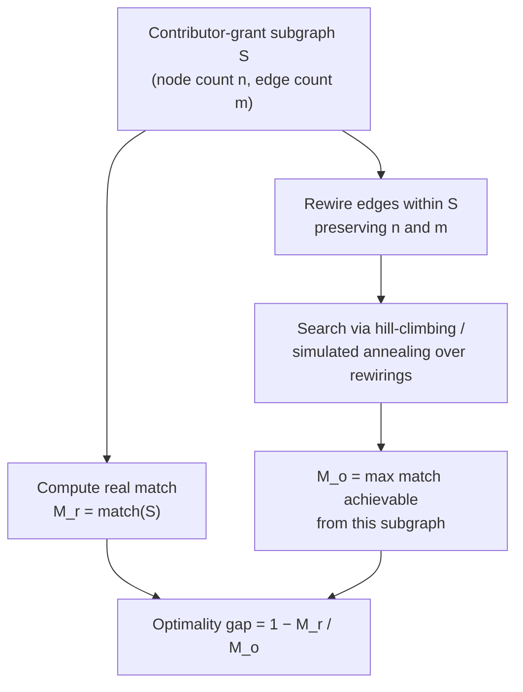

# Crowdfunding and open-source grants analysis

This cadCAD model and notebook series is a collaboration between Dynamical Systems Group and a Open Source Grants platform.. A brief table of contents follows to explain the file structure of the various documents produced in this collaboration.

Research archive. Originally developed 2020–2021.

## Introduction

This repository models a class of crowdfunded grants mechanisms — sponsor pools matched to grassroots donations according to formulas that weight *breadth* of community support rather than *depth* (dollar amount) alone. The specific matching formula studied here is quadratic funding (Buterin, Hitzig, Weyl 2019), but the methods extend to any donation-matching mechanism that aims to surface community preference via crowdfunded signal.

The matching formula penalizes concentrated funding sources and amplifies small donations from many distinct contributors — by construction, it favors community-supported projects over high-net-worth sponsorship. The mechanism's central design risk is its sensitivity to Sybil attacks and coordinated coalitions: a small group of colluding contributors can manufacture the appearance of broad support, capturing matching funds intended for diffusely-supported projects. The matching-mechanism literature therefore lives at the intersection of mechanism design, network analysis, and adversarial-robustness theory.

The work in this repo splits across three threads: **attack characterization** (what real attacks look like in funding-round data), **detection and quantification** (post-hoc identification of Sybils and the matching pool at risk), and **parameter sensitivity** (how mechanism choices shift the collusion–participation trade-off).

### Attack characterization

- What attack-pattern topologies appear in real funding-round contribution graphs? Two recurring patterns are surfaced in the data: *many-to-one* (one contributor funding many grants) and *many-to-many* (coordinated clusters of contributors and grants).
- For a given subgraph of suspected colluders, how much matching funding could the attacker extract via edge-rewiring? Cast as a meta-heuristic optimization over the contributor-grant bipartite graph using hill-climbing and simulated annealing (per the methodology in Paterson & Ombuki-Berman 2020).
- How does the optimality gap — the distance between actual and ideal matching allocations — shift in response to specific adversarial inputs?

### Detection and quantification

- Can supervised-learning classifiers (Random Forest, Decision Tree) trained on contributor-graph features flag likely Sybil contributors, and how do they perform under standard cross-validation metrics (ROC AUC)?
- For a flagged subset of likely Sybils, what fraction of the matching pool was at risk of mis-allocation?
- Which network structures in the contributor-grant bipartite graph correspond to coordinated coalitions versus organic clusters of community-supported projects? Surfaced via greedy-modularity community detection.

### Parameter sensitivity

- How do parameter choices (matching budget, contribution caps, identity-verification thresholds) shift the collusion–participation trade-off?

The work was developed in collaboration with an open-source grants platform that had run multiple historical funding rounds, providing the empirical contribution-graph data the analysis is calibrated against.

## Model framework

Built in [cadCAD](https://cadcad.org/) — a Python framework for modeling and simulating complex adaptive systems. The model treats each funding round as a discrete simulation: a contribution-graph state evolves through a sequence of donation events, with the matching algorithm computed at the end of each round and the optimality gap evaluated against a reference allocation.

## How to use

1. Install dependencies: `pip install -r requirements.txt` (Python 3.7+ recommended via Anaconda)
2. Adjust simulation parameters in `env_config.py`
3. Run the simulation: `python run_simulation.py` (generates a pickled simulation result)
4. Open one of the notebooks in `notebooks/` to inspect results

The `run_simulation.py` script accepts CLI flags that override `env_config.py` for common scenarios.

## Folder Structure (`qf_research/`)

Python utilities backing the notebooks:

- `quadratic_match.py` — reference implementation of the matching algorithm, including pairwise contribution-overlap computations
- `subgraph_optimizer.py` — adversarial-subgraph analysis: given a subset of nodes in the contributor-grant bipartite graph, finds the rewiring of edges within that subgraph that maximizes a chosen utility function (e.g., matching funds extracted). Used to characterize worst-case attack scenarios on a given subgraph.
- `meta_heuristics.py` — hill-climbing and simulated-annealing meta-heuristics that drive the subgraph optimizer (per Paterson & Ombuki-Berman 2020 on network-robustness optimization via edge rewiring)
- `definitions.py` — core metrics including `grant_conjectured_optimality_gap` (computed on a radius-3 neighborhood subgraph around each grant) and per-grant matching share
- `compare.py`, `functions.py` — comparison utilities and helpers

The adversarial-subgraph analysis flow:

## Notebooks

Nine notebooks in `notebooks/` partition the analysis surface:

**Security-focused**
- `round_9_supervised_public.ipynb` — supervised-ML pipeline for Sybil detection on historical funding-round data: Random Forest and Decision Tree classifiers with k-fold cross-validation (ROC AUC scoring). Outputs per-contributor Sybil flags and quantifies both the flagged-user fraction and the *flagged-amount fraction* — i.e., the share of the matching pool that was at risk of mis-allocation under each classifier's predictions.
- `round_9_attack_analysis.ipynb` — post-hoc characterization of attack-pattern graph topologies in the data: *many-to-one* and *many-to-many* structures.
- `round_9_fraud_EDA.ipynb` — exploratory data analysis of attacker behavior in the contribution graph.
- `attack_vector_ab_test.ipynb` — A/B testing of attack vectors against the optimality-gap metric: measures how much the metric shifts in response to specific adversarial inputs.

**Mechanism characterization**
- `optimality_gap.ipynb` — distribution of the optimality gap (mis-allocation magnitude) across simulated funding rounds. The optimality gap is the central metric for evaluating mechanism robustness.
- `graph_communities.ipynb` — community detection on the contributor-grant bipartite graph using greedy modularity; useful for distinguishing coordinated coalitions from organic clusters.
- `qf_performance_diagnosis.ipynb` — profiling and computational-complexity analysis of the matching algorithm itself.

**Networked-model exemplars**
- `dynamic_network.ipynb` and `temporal_network_example.ipynb` — examples of cadCAD's networked-model patterns.
